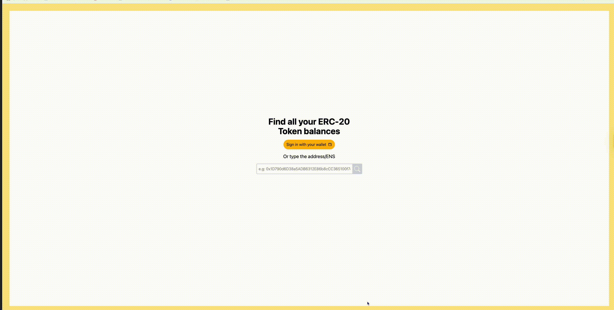

# Simple ERC-20 Indexer

This is a demo app built during the time I learned Ethereum at Alchemy University. 

## Set Up

1. Install dependencies by running `npm install`
2. Start application by running `npm run dev`

## Demo

## Challenges

1. Add Wallet integration so that any user that connects their wallet can check their ERC-20 token balance ✅
2. There is no indication of a request in progress... that's bad UX! Do you think you can add some sort of indication of loading? ✅
3. Add some styling! 🎨 ✅
4. The token balances can sometimes be a little long and break the outline of the page... can you fix that? 🔧 ✅
5. There is no error-checking for wrongly formed requests, or really any error checking of any kind... can you add some in? ✅
6. The images and grid display could look better... anything you can do about that? ✅
7. There are ways to make this app faster... can you implement some of them? How can the query be made _even_ quicker? ⏰
8. Can you add ENS support for inputs? ✅